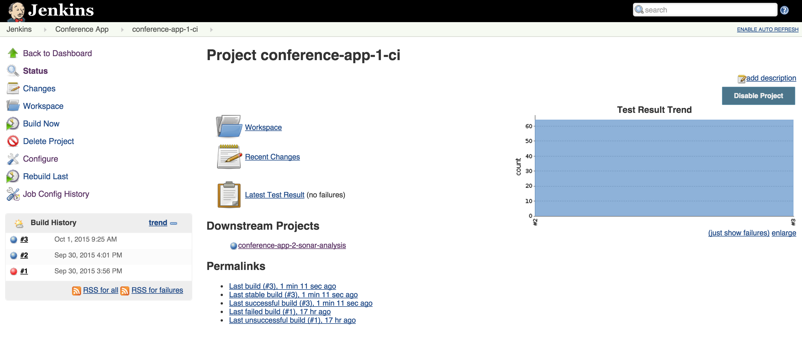
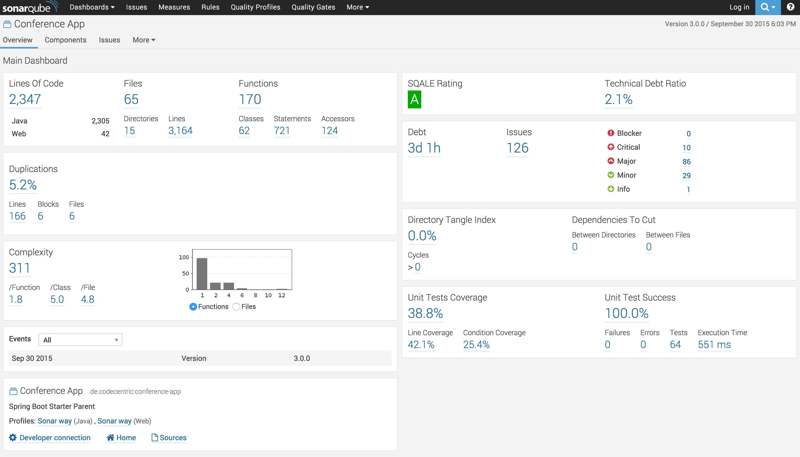

# Plateforme CI/CD de type "bac a sable".
(**Note:** Pour un environnement de production un systeme de PaaS comme Openshift ou Kubernetes est fortement conseille). 

Ce repository GitHub contient des fichiers docker-compose YAML 
qui permettent d'executer la mise en place d'une plateforme de containers
Docker qui simule un systeme de **Continuous** **Integration** et de **Delivery**. 


Cette plateforme est disponible  seulement sous Linux. 

## Pre-requis pour Centos 7

```
sudo yum -y update 
sudo yum -y install git
git clone https://github.com/plb-formation/ci-cd.git
cd ci-cd
```

### Installation de la derniere version de Docker sous Centos 
L'installation de Docker necessite certains packages.
```
sudo yum install -y yum-utils \
  device-mapper-persistent-data \
  lvm2
```
Ensuite on met en place le repository Docker.
```
sudo yum-config-manager \
    --add-repo \
    https://download.docker.com/linux/centos/docker-ce.repo
```
Installer la derniere version de Docker et de ses packages client et containerd.io
```
 sudo yum install docker-ce docker-ce-cli containerd.io
```
Lancer le daemon Docker 
```
sudo systemctl start docker
```
Placer un lien symbolique pour que le daemon Docker demarre automatiquement meme si le host est reboote. 
```
sudo systemctl enable docker
```
Installation de Docker compose 
```
sudo yum install docker-compose
```

## Installation de Docker avec un script Ansible 
### Packages de pre-requis pour installer Ansible 
```
sudo yum -y install epel-release python-pip 
```
Installation d'Ansible avec Python Pip pour obtenir la derniere version d'Ansible
```
sudo pip install ansible
```

### Lancement de la commande ansible-playbook
```
ansible-playbook -i inventory setup-docker 
```

## Plateforme CI/CD
### Lancement avec un docker-compose

Tapez la commande suivante pour installer et demarrer l'ensemble des containers de la plateforme de CI/CD

```
docker-compose up -d 
```
### Lancement par script Ansible 
```


```


## UPDATE for Linux Users

### Automatically

Please run **docker-compose.yml.native-docker-fix.sh** before executing **docker-compose up**.
This will fix the Docker binary PATH, see [Issue 24](https://github.com/marcelbirkner/docker-ci-tool-stack/issues/24).
This script patches the docker-compose.yml.

### Manually

Please alter Line 23 in docker-compose.yml under jenkins / volumes from

- /usr/local/bin/docker:/usr/bin/docker

to

- /usr/bin/docker:/usr/bin/docker

This is because '/usr/bin/docker' is the docker binary, see [Issue 24](https://github.com/marcelbirkner/docker-ci-tool-stack/issues/24).

## Access Tools

#### With docker machine

| *Tool* | *Link* | *Credentials* |
| ------------- | ------------- | ------------- |
| Jenkins | http://${docker-machine ip default}:18080/ | no login required |
| SonarQube | http://${docker-machine ip default}:19000/ | admin/admin |
| Nexus | http://${docker-machine ip default}:18081/nexus | admin/admin123 |
| GitLab | http://${docker-machine ip default}/ | root/5iveL!fe |
| Selenium Grid | http://${docker-machine ip default}:4444/grid/console | no login required |
| Conference App | http://${docker-machine ip default}:48080/currentSessions | no login required |

#### With Docker Mac Native

| *Tool* | *Link* | *Credentials* |
| ------------- | ------------- | ------------- |
| Jenkins | http://localhost:18080/ | no login required |
| SonarQube | http://localhost:19000/ | admin/admin |
| Nexus | http://localhost:18081/nexus | admin/admin123 |
| GitLab | http://localhost | root/5iveL!fe |
| Selenium Grid | http://localhost:4444/grid/console | no login required |
| Conference App | http://localhost:48080/currentSessions | no login required |

## Screenshots

Here is an overview of all tools:

- GitLab is used for storing the Source Code
- Jenkins contains build job and is triggered once projects in GitLab are updated
- As part of the CI build, Jenkins triggers a static code analysis and the results are stored in SonarQube
- The Maven build uses Nexus as a Proxy Repository for all 3rd party libs. The build artifacts are deployed to the Nexus Release Repository
- The Selenium Grid contains Docker containers running Chrome and Firefox and is used for UI tests

### Jenkins Jobs

There are several jobs preconfigured in Jenkins.
The Jobs cover the following tasks:

- Continuous Integration Build with Maven
- Unit Tests
- Static Source Analysis results are stored in SonarQube
- JaCoCo Test Coverage
- Deployment to Nexus
- Jenkins Job DSL examples
- Selenium UI Test




### SonarQube Dashboard



### Nexus Repository


### Selenium Grid


## Testing Upgrades

In order to test new versions, I prefer starting out with a blank VirtualBox image.
That eliminates any side effects. Afterwards you can throw away the image.

```
# Create new image
docker-machine create --driver virtualbox --virtualbox-memory 6000 docker-ci-v1

# Configure shell environment
eval $(docker-machine env docker-ci-v1)
```
# echo platinum
